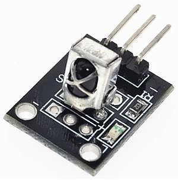
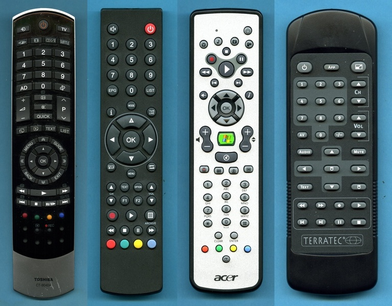

# IRremoteControl
The program uses the IRremote library to explore the codes
of infrared remote controls. The codes for 5 different
remote controls are stored in a table which you can complete
with your own codes.

Each time a button is pressed, the table is searched for the
decoded command and the assigned action is executed.

With the buttons 0..4 we can switch from one controller to another.
The ON/OFF button toggles the builtin Led.
## Parts
The IR receiver breakout is from a sensor kit for Arduino



## Wiring

```
  IR Receiver               Arduino UNO 
.-------------.           .---------------
|             |           | 
| .---.     Y o---------> o 11
| | X |     R o---------> o 5V
| `---´     G o---------> o GND
|             |           |
`-------------´           `---------------
```

## Layouts and command codes
### TOSHIBA TV CT-90404 NEC Protocol 
```
.------------------------------.
|           on/off             |
|            0x12              |
|      0x14        0x44        |
|   0x11  0x59  0x13  0x0C     |
|                              |
|      0x01  0x02  0x03        |          1  2  3
|      0x04  0x05  0x06        |          4  5  6       
|      0x07  0x08  0x09        |          7  8  9
|      0x62  0x00  0x52        |         AD  0  <->  
|                              |
|      0x1A  0x16  0x1B        |
|      ||||  0x10  ||||        | 
|      0x1E  0x63  0x1F        |
|                              |
|   0xDA  0x66  0x17  0x47     |
|                              |
|            0x73              |
|      0x5B  0x19  0x45        |
|                              |
|  <<    <     OK    >     >>  |
| 0x75  0x42  0x21  0x40  0x76 |
|                              |
|       0x64  0x1D  0x43       |
|             0x74             |
|                              |
|       0x53  0x67  0x0D       |
|    0x54  0x68  0x6A  0x15    |
|    0x48  0x49  0x4A  0x4B    |
|          0x22  0x6F          |
`------------------------------´
```

### NONAME RC5 Protocol 

```
.----------------------------.
|   SPKR             on/off  |
|   0x0D              0x0C   |
|                            |
|      0x01  0x02  0x03      |          1  2  3
|      0x04  0x05  0x06      |          4  5  6       
|      0x07  0x08  0x09      |          7  8  9
|      0x2C  0x00  0x2A      |        EPG  0  LIST  
|                            |
|            0x4E            |
|      0x2F        0x45      |
|            0x20            |
|   0x11     0x57     0x10   |
|            0x21            |
|   0x2D              0x22   |
|            0x52            |
|                            |
|   0x30  0x3C  0x23  0x40   |
|   0x31  0x38  0x39  0x41   |
|                            |
|   0x53     0x55     0x46   |
|                            |
|   0x54  0x35  0x58  0x56   |
|   0x37  0x36  0x32  0x34   |
`----------------------------´
```
### ACER RC6 Protocol 
```
.----------------------------.
|                    on/off  |
|                     0x0C   |
|   0x46  0x47  0x49  0x4A   |
|            0x19            |
|      0x17        0x18      |
|    0x15    0x16    0x14    |
|        0x1B    0x1A        |
|   0x23     0x1E     0x0F   |
|      0x20  0x22  0x21      |
|            0x1F            |
|   0x10              0x12   |
|    \\\     0x0D     ///    |
|    0x11            0x13    |
|            0x0E            |
|   0x48  0x26  0x25  0x24   |
|                            |
|      0x01  0x02  0x03      |          1  2  3
|      0x04  0x05  0x06      |          4  5  6       
|      0x07  0x08  0x09      |          7  8  9
|      0x1D  0x00  0x1C      |          *  0  #  
|                            |
|        0x0A    0x0B        |
|   0x5B  0x5C  0x5D  0x5E   |
|             0x5A           |
`----------------------------´
```

### TERRATEC NEC
```
.----------------------------.
|    0x0A    0x0B    0x0C    |
|                            |
|   0x01  0x02  0x03  0x0D   |          1  2  3
|                            |
|   0x04  0x05  0x06  0x0E   |          4  5  6
|                            |
|   0x07  0x08  0x09  0x0F   |          7  8  9 
|                            |
|   0x11  0x00  0x12  0x10   |             0
|                            |
|                            |
|    0x13    0x15    0x14    |
|                            |
|    0x17    0x19    0x18    |
|                            |
|    0x1B    0x16    0x1A    |
|                            |
|                            |
|   0x1C  0x1D  0x1E  0x1F   |
|                            |
|   0x20  0x21  0x22  0x23   |
`----------------------------´
```


### ELEGOO NEC
```
.--------------------.
| on/off  V+  FNC/STP | 
|  0x45  0x46  0x47   |
|                     |
|  ¦<<    >||   >>¦   |
|  0x44  0x40  0x43   |
|                     | 
|   DWN   V-    UP    | 
|  0x07  0x15  0x09   |
|                     |
|    0    EQ  STP/RPT |
|  0x16  0x19  0x0D   |
|                     |
|    1     2     3    |   In this remote control
|  0x0C  0x18  0x5E   |   the codes for the digits 
|                     |   do not correspond 
|    4     5     6    |   directly to the digits
|  0x08  0x1C  0x5A   |   themselves as in the
|                     |   previous remote controls.
|    7     8     9    |   
|  0x42  0x52  0x4A   |
`---------------------´ 
 
```
## IR Remote Controls

